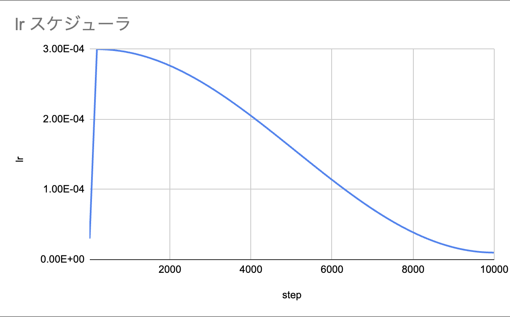
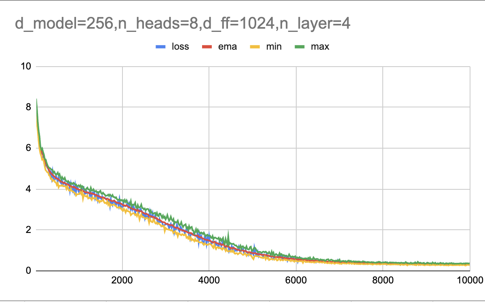

# transformer

Rust で書かれた Transformer (decoder-only) 言語モデルの学習・推論実装。
外部 ML フレームワークに依存せず、 行列演算から自前で実装している学習用プロジェクト。

## 依存

- Rust (edition 2024)
- `rand = "0.10.1"`
- `rayon = "1.10"` — 行列演算・損失計算の並列化
- `matrixmultiply = "0.3"` — `Matrix::matmul` の SIMD 最適化された pure-Rust BLAS（非 macOS 環境のフォールバック）
- macOS: Apple Accelerate Framework — OS 標準なので追加クレート不要、 `#[link(name = "Accelerate", kind = "framework")]` で直接リンク

## 実行

### 学習

```bash
cargo run --release
```

`Config::tiny_shakespeare()` で定義された設定で学習が始まり、 `checkpoints/<run_name>/` 配下に
checkpoint が保存される。

### CSV ログとして保存

学習ログは CSV 形式 (`step,loss,ema,min,max,lr,ms_per_step,elapsed_s`) で標準出力に流れる。
コンパイラ出力やヘッダーコメントを除外して CSV を取り出すには:

```bash
cargo run --release -q 2>&1 | tee train.log
grep -E '^(step,|[0-9]+,)' train.log > train.csv
```

`-q` で cargo の `Compiling`/`Finished` メッセージを抑制し、 `grep -E` で
ヘッダー (`step,...`) と数字始まりの行のみを抽出する。

### checkpoint から再開・推論

`src/main.rs` の `main()` 内で対応する関数の呼び出しを切り替える:

```rust
fn main() {
    let corpus_text = load_corpus("corpus/train.txt");
    let cfg = Config::tiny_shakespeare();

    // 新規学習
    training_and_inference(&corpus_text, &cfg);

    // checkpoint から再開（同じモデル構造の checkpoint のみ）
    // training_from_checkpoint(&corpus_text, &cfg, "checkpoints/<run_name>/latest.bin");

    // checkpoint を読み込んで推論のみ
    // inference_from_checkpoint(&cfg, "checkpoints/<run_name>/inference.bin");
}
```

`training_from_checkpoint` で再開する場合、 checkpoint の `d_model` / `n_heads` / `d_ff` /
`n_layers` / `vocab_size` が `Config` と一致している必要がある。 構造を変えた場合は
`training_and_inference` (fresh start) を使う。

## 設定

`src/main.rs` の `Config::tiny_shakespeare()` で全パラメータを指定する。

| 項目 | 役割 |
|------|------|
| `run_name` | checkpoint 保存先サブディレクトリ名 |
| `d_model` / `n_heads` / `d_ff` / `n_layers` | モデル構造 |
| `max_len` | 最大コンテキスト長（位置エンコーディング上限） |
| `vocab_size` | BPE トークナイザの語彙サイズ |
| `lr_max` / `lr_min` / `warmup_steps` | 学習率スケジュール（warmup + cosine decay） |
| `end_step` | 総学習ステップ数 |
| `batch_size` | ミニバッチサイズ |
| `save_every` / `log_every` | checkpoint 保存・ログ出力間隔 |

## ディレクトリ構成

```
src/
├── main.rs                    # エントリ・学習ループ
├── language_model.rs          # モデル全体（埋め込み→Transformer→出力）+ generate
├── transformer.rs             # Transformer (block の積み重ね)
├── transformer_block.rs       # 1 ブロック (MHA + FFN + LayerNorm)
├── multi_head_attention.rs    # マルチヘッドアテンション
├── feed_forward_network.rs    # 位置ごとの FFN
├── layer_normalization.rs
├── embedding.rs               # トークン埋め込み
├── sinusoidal_pe.rs           # 正弦波位置エンコーディング
├── output_head.rs             # 語彙への射影
├── adam_w.rs                  # AdamW オプティマイザ
├── lr_scheduler.rs            # warmup + cosine スケジューラ
├── cross_entropy_loss.rs
├── bpe_tokenizer.rs           # BPE トークナイザ
├── checkpoint.rs              # 重み・状態の保存/読込
└── matrix.rs                  # 行優先 flat 表現の `Matrix` と並列化された行列演算

corpus/
└── train.txt                  # 学習データ（全行を連結し、 ランダム窓でサンプリング）

checkpoints/<run_name>/
├── step_NNNNNN.bin            # 学習途中の checkpoint
├── latest.bin                 # 直近の checkpoint
└── inference.bin              # 学習完了後の推論用 checkpoint
```

## 並列化と性能

### ベンチマーク (M1 Max / 10 コア)

`d_model=256, n_heads=8, d_ff=1024, n_layers=4, max_len=128, batch_size=16, vocab_size=4000`
構成での 1 step あたり所要時間:

| 実装 | 1 step (steady) | vs 前段 | vs 初期 (推定) | 出典 |
|------|----------------|--------|---------------|------|
| ① Vec<Vec<f32>> + シリアル | ~30 s | — | 1× | 推定 (実効 ~0.7 GFLOP/s × 全 step ~20 GFLOPs) |
| ② Vec<Vec<f32>> + rayon | ~3.0 s | **10×** | 10× | Phase 2 (checkpoint mtime) |
| ③ Matrix + rayon naive | ~3.0 s | 1.0× | 10× | `phase2_d256_ff1024_max128_before_blas.log` |
| ④ Matrix + matrixmultiply | ~1.29 s | **2.3×** | 23× | `phase2_d256_ff1024_max128_with_blas.log` |
| ⑤ Matrix + Apple Accelerate (AMX) | **~0.745 s** | **1.7×** | **約 40×** | `phase2_d256_ff1024_max128_with_accelerate.log` |

10000 step 学習が **約 8 時間 → 約 2 時間** (Accelerate) に短縮。 ① の数値は実測ではなく
シングルスレッド `Vec<Vec<f32>>` matmul の経験則 (実効 0.5〜1 GFLOP/s) からの外挿。

長時間負荷では M1 Max の thermal throttling で初期 660 ms → 定常 745 ms に落ち着く。
短時間ベンチでは更に速い値が出る。

### `Matrix` の役割

行列演算は `crate::matrix::Matrix` に集約されている。
内部表現は **行優先 (row-major) の flat `Vec<f32>`** で、 jagged な `Vec<Vec<f32>>` ではない。

主な API:
- 構築: `zeros`, `from_jagged`, `from_flat`
- 演算: `matmul`, `transpose`, `add_in_place`, `add_row_bias_in_place`,
  `sum_rows_into_cols`, `map`, `elementwise_with`, `softmax_rows_in_place`
- MHA 用: `split_columns(n)` / `concat_columns(&[Matrix])`

flat 表現により、 BLAS への ptr/stride 渡しが **ゼロコピー** (`leading_dim = cols`)。

### `matmul` の OS 別バックエンド

```rust
#[cfg(target_os = "macos")]
unsafe { accelerate::cblas_sgemm(...) }   // AMX 自動活用

#[cfg(not(target_os = "macos"))]
unsafe { matrixmultiply::sgemm(...) }     // pure-Rust SIMD カーネル
```

- **macOS**: Apple Accelerate Framework の `cblas_sgemm` を `extern "C"` + `#[link]` で直接呼び出す。 M1/M2/M3 系では行列サイズに応じて **AMX co-processor** が自動選択される。
- **その他 OS**: `matrixmultiply` クレート (pure-Rust の SIMD/キャッシュタイル実装) にフォールバック。

`matmul_naive` (rayon `i-k-j`) も保持しており、 `matmul_blas_matches_naive_for_random_matrices`
テストで両者の数値一致 (浮動小数誤差 ≤ `1e-3 × k`) を検証している。

### rayon で並列化されている処理

| 処理 | 並列粒度 |
|------|---------|
| `matrix::matmul_naive` | 出力行 (`par_chunks_mut`) |
| `matrix::transpose` | 出力行 |
| `matrix::add_in_place` | 要素 |
| `matrix::softmax_rows_in_place` | 行 |
| `output_head::logits_last` | vocab 次元 |
| `cross_entropy_loss::forward_sequence` | token |

`matmul` 本体は rayon 不要 (BLAS バックエンドが内部でマルチコア活用)。

### Matrix を経由する主要処理

- `multi_head_attention`: Q/K/V/O 射影、 scaled-dot-product attention、 head 分割・結合
- `feed_forward_network`: forward / backward すべて、 bias 加算、 GELU、 勾配集計
- `output_head`: forward / backward すべて、 `logits_last` (単一トークン推論最適化)

### Matrix 非経由 (軽量で並列化対象外)

- `embedding`: token id ベースの lookup
- `layer_normalization`: 行ごとの統計量計算 (d_model 方向のみで小規模)
- `sinusoidal_pe`: 加算のみ

### AdamW との橋渡し

`AdamW::step_matrix_flat(&mut self, &str, &mut Matrix, &Matrix)` が `Matrix` を直接受け取る。
内部の `AdamWParam.data` も `Vec<f32>` (flat) なので、 jagged ↔ flat の **flatten 変換コストはゼロ**。

## チューニングのコツ

実装と実験を通じて得られた知見のまとめ。

### 学習データの整形
- **行ごとに切らず、 コーパス全体を 1 つの token 列に連結** してランダム窓でサンプリングする方が、 対話・改行・句読点などの構造を学習できる。
- 行ごとに `<EOS>` を付けると EOS バイアスが発生し、 推論時に 1 token で打ち切られやすくなる。 連結方式では EOS は不要 (`max_new_tokens` で停止)。

### 学習率
- `lr_max ≒ 3e-4`、 `lr_min ≒ 1e-5`、 `warmup_steps ≒ 200` が小規模 Transformer の典型値。
- `lr_min` を `0` 付近にすると終盤が完全に止まるため、 **`1e-5` 程度のフロアを残す**。
- checkpoint から `end_step` を伸ばして再開すると、 scheduler の進捗がリセットされて lr が上振れする (**warm restart 効果**)。 停滞局所解からの脱出に使える。



実際のスケジュール (`end_step=10000`)。 200 step で `lr_max=3e-4` まで一気に立ち上がり、 そこから cosine で
`lr_min=1e-5` まで滑らかに減衰する。 序盤の急峻な warmup と、 終盤の floor (完全に 0 にしない) が肝。

### バッチとミニバッチ勾配
- `batch_size` 個の `forward_backward` で勾配を累積し、 まとめて 1 回 `apply_gradients` する。
- AdamW の `step_count` も 1 step に 1 回しか進めない (パラメータごとに進めない)。
- 累積勾配は `set_grad_scale(batch_size)` で平均化扱いにし、 `apply_gradients` 後に `zero_grad` でリセットする。

### モデル構造の比率
- `d_ff = 4 × d_model` が標準 (GPT-2、 nanoGPT 等)。 FFN は知識を蓄える主役なので `d_model` を増やすときは `d_ff` も比例して増やす。
- `d_head = d_model / n_heads = 32〜64` が扱いやすい。
- `max_len` を上げると attention は `O(n²)` で重くなる。 学習対象 (対話 1 ターン: ~100 token、 シーン: ~500 token) に合わせて選ぶ。

### 推論時の繰り返し対策
- greedy はすぐに同じ語句に落ち込みやすいので、 **top-k サンプリング + 適度な temperature** (例: `top_k=5, temperature=1.0`) の方が自然な文章になる。
- `my lord, my lord, ...` のような繰り返しは **repetition penalty** で軽減する。 `LanguageModel::generate*` は `repetition_penalty` 引数を受け取り、 `1.1〜1.3` 程度が無難。 HuggingFace と同じ式 (正は割り算、 負は掛ける) で過去に出現した token を抑制。

### checkpoint 運用
- `run_name` を分けることで、 設定違いの実験を上書きせずに並走できる (`checkpoints/<run_name>/`)。
- モデル構造 (`d_model` 等) を変えると checkpoint 互換性が失われるため、 構造変更時は fresh start (`training_and_inference`) を使う。

### 過学習と最適 step の見極め

Tiny Shakespeare (~330k token) を `d_model=256` モデルで 10000 step 学習させた実例:



序盤 (~500 step) で急減、 中盤 (500〜3000 step) は穏やかに低下、 終盤 (4000 step 以降) は ema が
1.0 を切り `~0.3` まで下がり続ける。 数値上の収束に対して、 **推論品質のピークは loss が 2〜3 前後の
中盤帯 (step 2500〜3500)** にあり、 後段の loss 低下は過学習による記憶化に対応する。

| step | loss | perplexity | 推論品質 |
|------|------|-----------|---------|
| 500 | 4.51 | ~91 | 戯曲フォーマットだけ習得、 文は支離滅裂 |
| 2000 | 3.10 | ~22 | シーン構造成立、 局所文法 OK |
| **2500** | **2.79** | **~16** | **品質ピーク** (配役・トーン・流暢さがバランス良く整う、 後述の「推論サンプル」参照) |
| 3000 | 2.27 | ~10 | 品質ピーク帯の終わり |
| 3500 | 2.01 | ~7.5 | 単一シーン品質は時に絶品 (Richard III 等)、 ただし造語が混じり始める |
| 5000 | 0.88 | ~2.4 | 過学習開始 (BPE merge 由来の造語が頻発) |
| 10000 | 0.32 | ~1.4 | 完全記憶状態 (配役は更に絞り込まれるが造語多発) |

loss が下がり続けても汎化品質は途中から劣化する典型例。 **品質ピークは step 2500〜3500 の狭い帯**で、
それ以降は「loss は下がるが造語が増える死の谷」に入る。 step 4000〜8000 は loss 単調減少にもかかわらず
推論結果に BPE artifact が散在し品質が落ちる、 step 10000 で再び配役整合は精緻化するが造語は残る、
という非単調な進行を見せる。

**checkpoint は loss 最小ではなく、 推論品質ピークで選ぶ**のが実用的。
正則化 (dropout, weight decay) を導入していないので、 大きめのモデル × 小さなコーパスでは
このパターンになりやすい。

## 推論サンプル (best checkpoint: step 2500)

Accelerate 版 (`phase2_d256_ff1024_max128_with_accelerate`) の **step 2500** チェックポイントを
`top_k=5, temperature=1.0, repetition_penalty=1.2, max_new_token=100` で生成した結果。
学習開始から約 29 分で到達した、 loss=2.785 / perplexity≈16 の状態。

各プロンプトが **異なる作品にきれいに着地**しているのが特徴 (Measure for Measure / Romeo & Juliet /
Winter's Tale / Coriolanus と 4 作品が分散)。 単に登場人物名が合っているだけでなく、 **シーンのトーン
(神学・恋愛・田舎喜劇・政治) もそれぞれの作品らしさ**を持っている。

### prompt: "I have seen" → Measure for Measure

```
i have seen.

duke vincentio:
your grace of justice, sir; your honour is worth the friar,
and you shall be satisfied withal.

isabella:
but, as if you were a father had so long
that in the fault have found it, which should not
to make his instantify him that he would
hear me give my life.

duke vincentio:
this is angelo for the world with him
that he hath made good success and cut away
```

### prompt: "O Romeo" → Romeo & Juliet

```
o romeo, thou art not proud;
thy lips might have been so many a man:
the good captain of death is in his way,
to help me and romeo from whence are come,
and i will be long with my tent there.
i am too far in my heart, to make thee think
where he did send to him to me at me;
and let him speak no better it as myself.

juliet:
but, by your grace of joy!
```

### prompt: "To be or not to be" → Winter's Tale

```
to be or not to be long.

autolycus:
i shall be of it, sir: and you know the
way, sir, have your voices.

clown:
i do beseech your worship, give no leave to be so.

shepherd:
are you now, good morrow; and, indeed, for your daughter?

autolycus:
i will be a thousand of it, if it be but
done, it is a mach.

clown:
how could you
```

### prompt: "What news" → Coriolanus

```
what news abroad, i
to give my vow; but come on your highness' hands
i would not have heard the crown.

second gentleman:
i know no longer, i am sorry that he had so
discreep o'er again: therefore i'll do you
more than you in this.

first senator:
i will not hence.

brutus:
go along with us.

menenius:
nay, good madam, go.
i have a soldier
```

### この checkpoint からの推論方法

```rust
// src/main.rs
fn main() {
    let cfg = Config::tiny_shakespeare();
    inference_from_checkpoint(
        &cfg,
        "checkpoints/phase2_d256_ff1024_max128_with_accelerate/step_002500.bin",
    );
}
```

## 今後の改善案

### 過学習の抑制
- **dropout** (現在 0)、 **weight decay** (現在 0) を導入して loss 1.5〜2.0 で頭打ちさせる
- コーパス拡大 (Tiny Shakespeare → 全集、 あるいは Project Gutenberg) で素直にスケールさせる

### Linux / Windows 向け OpenBLAS / Intel MKL バックエンド
macOS の Accelerate と同じ構造 (`#[cfg(target_os = ...)]` 分岐) で `openblas-src` + 自前 extern、
もしくは `ndarray-linalg` 経由で OpenBLAS / MKL を呼べる。

### モデルサイズ拡大による AMX の本領発揮
現状の `d_model=256` では 1 つの matmul サイズが中規模で AMX の旨味が部分的。
`d_model=512〜768` に拡大すると matmul の比率も問題サイズも大きくなり、
Accelerate 単独効果が `1.7×` から **`2〜3×`** に伸びる見込み。

### 推論時のキャッシュ機構 (KV cache)
現在の `generate` は token 1 つ生成するたびに過去 token を含む全 context を attention で再計算。
KV cache (Q/K/V の中間結果を保持) を導入すれば 1 token 生成あたりの計算量が
`O(n)` → `O(1)` 近くまで下がる。 `max_len=128` 以上の生成で大きく効く。

### 生成制御の追加
- top-p (nucleus) sampling
- 最小生成 token 数 (`min_new_tokens`)
- bad words / banned ngrams フィルタ

### `layer_normalization`, `embedding` 等の Matrix 統一
これらは現在 `Vec<Vec<f32>>` をやりとりしており、 内部の API 境界で `Matrix::from_jagged`/
`to_jagged` 変換が走っている。 すべて `Matrix` で統一すれば変換コストが消える。
ただし計算ボトルネックではないので優先度は低い。

## ログの読み方

```
# run_name=phase2_d256_ff1024_max128_with_accelerate
# d_model=256, n_heads=8, d_ff=1024, n_layers=4, max_len=128, vocab_size=4000
# lr_max=0.0003, lr_min=0.00001, warmup_steps=200, end_step=10000, ...
# corpus_tokens=331204, chunk_len=128, max_offset=331076
step,loss,ema,min,max,lr,ms_per_step,elapsed_s
20,7.922065,8.275023,7.922065,8.424044,3.000e-5,661.3,13.2
40,7.347139,7.785185,7.228264,7.922489,6.000e-5,655.5,26.3
...
```

| 列 | 意味 |
|----|------|
| `step` | 現在の学習ステップ |
| `loss` | 当該ステップでのバッチ平均 loss |
| `ema` | 指数移動平均 loss (α=0.05) |
| `min` / `max` | 直近 `log_every` ステップ内の最小 / 最大 loss |
| `lr` | 当該ステップでの学習率 |
| `ms_per_step` | 直近 `log_every` ステップでの 1 ステップあたり平均所要時間 (ミリ秒) |
| `elapsed_s` | 学習開始からの累積経過時間 (秒) |
