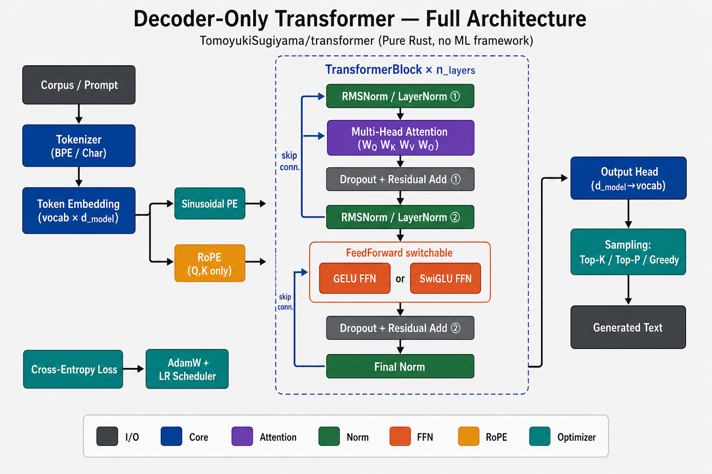
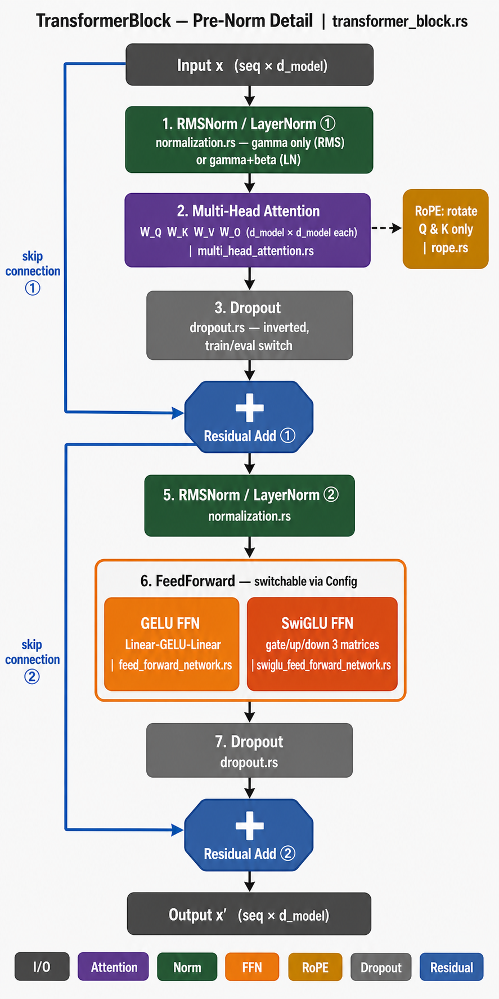
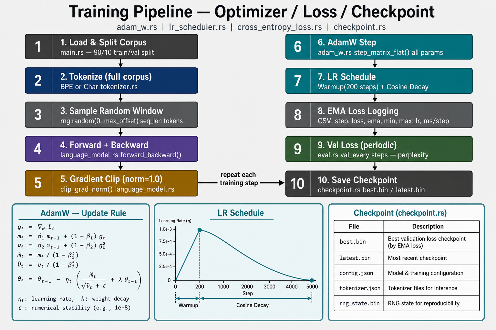
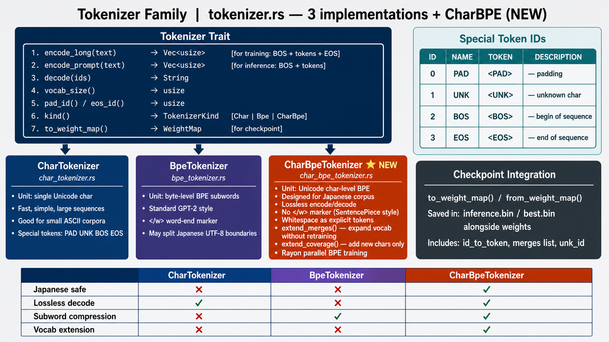
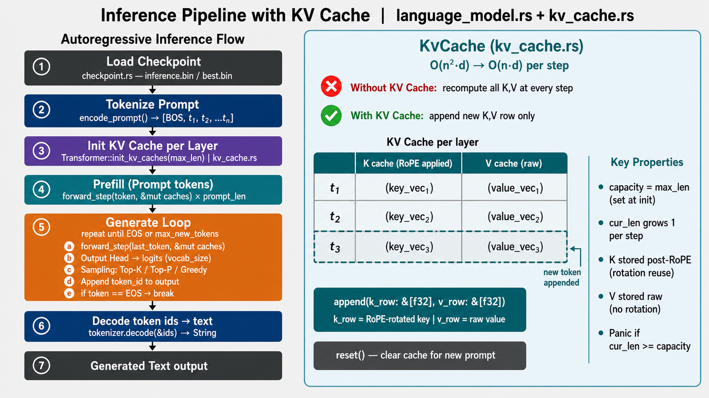

# transformer

Rust で書かれた Transformer (decoder-only) 言語モデルの学習・推論実装。
外部 ML フレームワークに依存せず、 行列演算から自前で実装している学習用プロジェクト。

## アーキテクチャ

### 全体像



GPT 系の **decoder-only 構成** で、 入力テキストを次のように処理する:

1. **Tokenizer**: 3 種類から選択 ([`tokenizer.rs`](src/tokenizer.rs))
   - **Char** ([`char_tokenizer.rs`](src/char_tokenizer.rs)) — 1 文字 1 トークン (小規模英語 / ASCII 向け)
   - **BPE** ([`bpe_tokenizer.rs`](src/bpe_tokenizer.rs)) — byte-level BPE (英語向け、 GPT-2 系)
   - **CharBPE** ([`char_bpe_tokenizer.rs`](src/char_bpe_tokenizer.rs)) — Unicode char-level BPE (日本語向け、 Phase 6 で導入、 詳細は [docs/phase6.md](docs/phase6.md))
2. **Token Embedding** (vocab × d_model): 各トークン ID を密ベクトルに射影 ([`embedding.rs`](src/embedding.rs))
3. **Positional Encoding**: 位置情報の注入を切替可能
   - **Sinusoidal PE** ([`sinusoidal_pe.rs`](src/sinusoidal_pe.rs)) — Embedding に加算する古典方式
   - **RoPE** ([`rope.rs`](src/rope.rs)) — Multi-Head Attention 内で **Q/K にのみ** 回転を適用 (LLaMA 系)
4. **TransformerBlock × n_layers** ([`transformer_block.rs`](src/transformer_block.rs)): Pre-Norm 構成で MHA + FFN を積層 (詳細は後述)
5. **Final Norm + Output Head** ([`output_head.rs`](src/output_head.rs)): d_model → vocab に射影してロジット化
6. **Sampling** ([`output_head.rs`](src/output_head.rs)): Greedy / top-k / **top-p (nucleus)** から選択し次トークンを決定

`Normalization` / `FeedForward` / `PositionalEncoding` の 3 軸は **trait + enum で切替可能** にしており、
Config の 1 行変更で LayerNorm ↔ RMSNorm、 GELU FFN ↔ SwiGLU FFN、 Sinusoidal ↔ RoPE を入れ替えられる
([Phase D で導入](docs/phase_d.md))。

### TransformerBlock の内部



1 ブロック内の処理:

1. **Pre-Norm**: 残差結合に入る前に正規化 ([`normalization.rs`](src/normalization.rs) / [`layer_normalization.rs`](src/layer_normalization.rs) / [`root_mean_square_layer_normalization.rs`](src/root_mean_square_layer_normalization.rs))
2. **Multi-Head Attention** ([`multi_head_attention.rs`](src/multi_head_attention.rs)): `W_Q W_K W_V W_O` を保持し、 因果マスクで自己回帰を担保。 RoPE 使用時は Q/K を head ごとに回転
3. **Dropout + Residual Add** ① ([`dropout.rs`](src/dropout.rs))
4. **2 回目の Pre-Norm**
5. **FeedForward (切替可能)**:
   - **GELU FFN** ([`feed_forward_network.rs`](src/feed_forward_network.rs)) — Linear → GELU → Linear (古典)
   - **SwiGLU FFN** ([`swiglu_feed_forward_network.rs`](src/swiglu_feed_forward_network.rs)) — gate/up/down の 3 行列 (LLaMA 流、 Phase D-3 で +35% per-step 高速化)
6. **Dropout + Residual Add** ② → 出力

Pre-Norm は Post-Norm に比べて **大規模モデルでの学習が安定** することが知られており、 nanoGPT/GPT-2 系と同じ採用方針。

### 学習パイプライン



1 step の処理サイクル:

1. **コーパス取得 + 90/10 train-val split** ([`main.rs`](src/main.rs))
2. **トークナイズ** (全文 1 回のみ、 後はバッチごとに窓を切り出す) ([`tokenizer.rs`](src/tokenizer.rs))
3. **ランダム窓サンプリング**: 各 step で `batch_size` 個の `(max_len + 1)` トークン窓を取り、 [入力, 教師] に分割
4. **Forward + Backward** ([`language_model.rs`](src/language_model.rs)): 逆伝播はチェーンルールで自前実装、 中間値をキャッシュして高速化
5. **Gradient Clip (norm=1.0)**: 勾配爆発を防ぐ
6. **AdamW Step** ([`adam_w.rs`](src/adam_w.rs)): m, v の 1 次/2 次モーメント + weight decay (decoupled)
7. **LR Schedule** ([`lr_scheduler.rs`](src/lr_scheduler.rs)): **warmup + cosine decay** または **WSD (Warmup-Stable-Decay)** から選択 (Phase 6-d/7-a で WSD 採用、 MiniCPM/DeepSeek 慣例)
8. **EMA Loss Logging**: CSV 形式で標準出力に流す ([`docs/tuning.md#ログの読み方`](docs/tuning.md#ログの読み方))
9. **Val Loss + BPC (定期)** ([`eval.rs`](src/eval.rs)): `val_every` step ごとにランダム窓 N 個で計測、 perplexity と BPC (bits per character) を算出
10. **Checkpoint 保存** ([`checkpoint.rs`](src/checkpoint.rs)): `best.bin` (val 最良) + `latest.bin` (直近)

損失は **クロスエントロピー (PAD は除外)** ([`cross_entropy_loss.rs`](src/cross_entropy_loss.rs))、 オプティマイザは AdamW 固定 (β1=0.9, β2=0.99 推奨)。
LR スケジューラと AdamW の数式・実装値は [`docs/tuning.md`](docs/tuning.md) に詳述。

### Tokenizer ファミリー



`Tokenizer` trait ([`tokenizer.rs`](src/tokenizer.rs)) に対して **3 実装** を持ち、 `TokenizerKind` enum で切替える。 特殊 token (`<PAD>` / `<UNK>` / `<BOS>` / `<EOS>`) の ID は 0-3 で固定。

| 実装 | 単位 | 日本語安全 | lossless decode | subword 圧縮 | 拡張 API |
|------|------|----------|----------------|------------|---------|
| **CharTokenizer** ([`char_tokenizer.rs`](src/char_tokenizer.rs)) | 1 Unicode char | ✅ | ✅ | ❌ | ❌ |
| **BpeTokenizer** ([`bpe_tokenizer.rs`](src/bpe_tokenizer.rs)) | byte-level BPE subword | ❌ (UTF-8 境界跨ぎ) | ❌ | ✅ | ❌ |
| **CharBpeTokenizer** ⭐ ([`char_bpe_tokenizer.rs`](src/char_bpe_tokenizer.rs)) | **Unicode char-level BPE** | ✅ | ✅ | ✅ | ✅ (`extend_merges` / `extend_coverage` / `add_special_token`) |

CharBPE は **Phase 6** で導入した新実装で、 日本語コーパスでの圧縮率と長文コンテキストを両立する。 SentencePiece と同方針で `</w>` マーカーは持たず、 空白も独立トークンとして保持するため decode は完全に lossless。 **Phase 7-1** で `add_special_token` API を追加し、 `<AUTHOR=...>` `<TITLE>` `<DRAMA>` 等の atomic トークンを BPE と独立に扱える (`<...>` 内が登録 special token と完全一致した場合のみ 1 token に。 詳細は [docs/phase7.md](docs/phase7.md))。 全体の設計と Phase 6-a/6-d の結果は [docs/phase6.md](docs/phase6.md) を参照。

### 推論パイプライン (KV Cache)



自己回帰生成では同じ過去 token に対して K, V を毎 step 再計算するのが無駄なため、 **`KvCache`** ([`kv_cache.rs`](src/kv_cache.rs)) で per-layer / per-head のキャッシュを持ち、 per-token 計算量を `O(n²·d) → O(n·d)` に削減している:

1. **Load checkpoint** ([`checkpoint.rs`](src/checkpoint.rs)) — `best.bin` / `inference.bin` の重みを復元
2. **Tokenize prompt** — `tokenizer.encode_prompt()` で `[BOS, t₁, ..., tₙ]` に変換
3. **Init KV cache per layer** — `Transformer::init_kv_caches(max_len)` で容量を確保
4. **Prefill** — プロンプト全 token を 1 つずつ `forward_step` に流して cache に積む
5. **Generate loop** — 直前 token 1 つだけを `forward_step` に渡して logits を取り、 sampling (top-k / top-p / greedy) で次 token を選択、 EOS で打ち切り
6. **Decode** — `tokenizer.decode(&ids)` でテキスト復元

`KvCache` は **K のみ RoPE 適用後** を保管 (位置依存の回転を再計算しないため)、 **V は raw** で保管。 詳細実装は [`docs/kv_cache.md`](docs/kv_cache.md) を参照。

## ドキュメント

詳細はフェーズ別・トピック別に `docs/` に整理してある:

| ドキュメント | 内容 |
|------------|------|
| [docs/performance.md](docs/performance.md) | 並列化と性能 (rayon / matrixmultiply / Apple Accelerate ベンチ、 `Matrix` 設計、 **Phase 7-1〜7-4 の累積 1.59x 高速化** = transpose 排除 + fused matmul-add + 一時バッファ削減) |
| [docs/tuning.md](docs/tuning.md) | チューニングのコツ (学習率・ミニバッチ・過学習・推論サンプリング) と CSV ログの読み方 |
| [docs/phase2.md](docs/phase2.md) | Phase 2: Tiny Shakespeare (BPE 4k, d_model=256) ベスト推論サンプル |
| [docs/phase3.md](docs/phase3.md) | Phase 3: nanoGPT 等価設定 (char 65, d_model=384) との直接比較・val_loss で 3.4% 上回る |
| [docs/phase4.md](docs/phase4.md) | Phase 4: 青空文庫 / 漱石 7 作品 (char) への拡張・容量律速の観察 |
| [docs/phase_d.md](docs/phase_d.md) | Phase D: モダンアーキテクチャ導入 (RMSNorm + SwiGLU + RoPE、 累積で val_ppl -1.5% / 学習時間 -41%) |
| [docs/phase5.md](docs/phase5.md) | Phase 5: 生成品質向上計画 (top-p / max_len 拡張 / コーパス拡大 / モデル拡大) |
| [docs/phase6.md](docs/phase6.md) | Phase 6: トークナイザ刷新 (char → Unicode char-level BPE)。 **6-a (max=512, BPC 3.76) と 6-d (max=1024 + WSD, BPC 3.74) の完走結果** |
| [docs/phase7.md](docs/phase7.md) | Phase 7-1: コーパス前処理 + 作家・戯曲 special token (戯曲記号混入 / 作家ヘッダ生成 / 章番号擾乱の構造的解決)。 Phase 7-a 学習設定 |
| [docs/phase8.md](docs/phase8.md) | Phase 8: 大規模コーパス + Tokenizer 拡大 + モデル拡大。 **8-1 [A]-[D] 完了** (Wikipedia 974.7M char 取得 / クレンジング、 Aozora+Wiki 混合 983M char、 CharBPE 32K 再訓練 chars/token=Aozora 1.795 / Wiki 1.873)。 [E] config 実装済 (d=768, n=8, ~50M params, end_step 10,000、 ~50 h 想定) / 起動待ち |
| [docs/sota_comparison.md](docs/sota_comparison.md) | SoTA LLM (LLaMA 3 / Claude / Gemini / DeepSeek) との要素別比較・本実装の立ち位置 |
| [docs/kv_cache.md](docs/kv_cache.md) | KV cache の実装解説 (per-token 計算量を `O(n²·d) → O(n·d)` に削減) |
| [docs/roadmap.md](docs/roadmap.md) | 今後の改善案 (Phase 6/7 進捗・ Flash Attention・ OpenBLAS 等) |

## 依存

- Rust (edition 2024)
- `rand = "0.10.1"`
- `rayon = "1.10"` — 行列演算・損失計算の並列化
- `matrixmultiply = "0.3"` — `Matrix::matmul` の SIMD 最適化された pure-Rust BLAS（非 macOS 環境のフォールバック）
- macOS: Apple Accelerate Framework — OS 標準なので追加クレート不要、 `#[link(name = "Accelerate", kind = "framework")]` で直接リンク

## 実行

### コーパス取得

学習データは外部から取得する。 用途別にスクリプトを用意してある:

```bash
# Tiny Shakespeare (1.1 MB, 英語) — Phase 2 / 3 用
./scripts/download_tiny_shakespeare.sh
# → corpus/tiny_shakespeare.txt

# 夏目漱石「こころ」 (162k char ≈ 484 KB UTF-8, 日本語) — Phase 4a 用
./scripts/download_aozora_kokoro.sh
# → corpus/aozora_kokoro.txt

# 夏目漱石主要長編 7 作品 (1.21M char ≈ 3.5 MB UTF-8, 日本語) — Phase 4b 用
./scripts/download_aozora_soseki_works.sh
# → corpus/aozora_soseki_works.txt
# 含まれる作品: 吾輩は猫である / 坊っちゃん / 草枕 / 三四郎 / 行人 / こころ / 道草
# (全て新字新仮名のみ。 「それから」「門」 は仮名遣いが異なるため除外)

# 明治-大正の主要 6 作家 (826 万 char ≈ 24.5 MB UTF-8, 日本語) — Phase 5-3 / 5-4 / 6 用
./scripts/download_aozora_meiji_taisho.sh
# → corpus/aozora_meiji_taisho.txt
# 含まれる作家: 夏目漱石 / 太宰治 / 森鴎外 / 宮沢賢治 / 中島敦 / 国木田独歩
# 全て新字新仮名、 504 作品取得、 ユニーク文字数 5,220
# (芥川は旧字旧仮名のみ公開のため除外)
```

青空文庫系のスクリプトは Shift-JIS zip から UTF-8 に変換し、
ルビ (`《...》`)・ 編集注記 (`［＃...］`)・ 底本情報を除去した本文を出力する
(python3 が必要)。

> Wikipedia 日本語版の取得 (Phase 8-1) は `parquet` / `arrow-array` / `arrow-schema` / `reqwest` を
> 追加で依存している (Cargo.toml 参照)。 学習側 binary には影響しないが、 cargo build は
> 重くなる。 corpus 取得が完了して以降は workspace 分離も検討候補。

#### 派生コーパス (Phase 7-1 / `src/bin/clean_aozora_corpus.rs`)

```bash
# Phase 7-a 用 v2 コーパス (生成: cargo run --release --features corpus-tools --bin clean_aozora_corpus)
# 旧 ===== 作家『タイトル』 ===== ヘッダを <BOS><AUTHOR=...><TITLE>...</TITLE> に変換、
# 戯曲フォーマット 8 作品を <DRAMA>...</DRAMA> で囲む、 章番号行 1131 行を削除。
# → corpus/aozora_meiji_taisho_v2.txt (504 作品、 ~8.28M char)
```

詳細は [docs/phase7.md](docs/phase7.md) を参照。

#### Wikipedia 日本語版 (Phase 8-1 / `src/bin/fetch_wikipedia_ja.rs` + `clean_wikipedia_corpus.rs`)

```bash
# [A] HuggingFace `wikimedia/wikipedia` (snapshot 20231101.ja) から
#     parquet を Pure Rust で取得し text 列を抽出。 累計 1B char 到達で打ち切り。
cargo run --release --features corpus-tools --bin fetch_wikipedia_ja
# → corpus/wikipedia_ja_raw.txt (~1.04B char / 370,523 記事、 2.5 GB)
# → corpus/_wiki_tmp/  (parquet キャッシュ、 不要なら削除可)

# [B] trailing reference section (脚注 / 出典 / 関連項目 / 外部リンク 他) 以降を
#     切り捨て + 短記事 (<200 char) 破棄 + 連続空行を 1 空行に正規化。
cargo run --release --bin clean_wikipedia_corpus
# → corpus/wikipedia_ja.txt (~974.7M char / 345,958 記事、 2.4 GB、 入力の 93.4% 保持)

# [C] Aozora v2 + Wikipedia ja を連結して混合コーパス生成 (Aozora は repeat なしで先頭に投入)。
cargo run --release --bin mix_corpus
# → corpus/aozora_wikipedia_mixed.txt (~983M char, 2.4 GB、 Aozora 0.84% / Wikipedia 99.16%)
```

ライセンス: CC-BY-SA 4.0 (Wikimedia Foundation)。 詳細は [docs/phase8.md](docs/phase8.md) を参照。

### 学習

```bash
cargo run --release
```

`src/main.rs` の `main()` で選択した `Config` (例: `Config::aozora_kokoro()`)
の設定で学習が始まり、 `checkpoints/<run_name>/` 配下に checkpoint が保存される。

### CSV ログとして保存

学習ログは CSV 形式 (`step,loss,ema,min,max,lr,ms_per_step,elapsed_s`) で標準出力に流れる。
コンパイラ出力やヘッダーコメントを除外して CSV を取り出すには:

```bash
cargo run --release -q 2>&1 | tee train.log
grep -E '^(step,|[0-9]+,)' train.log > train.csv
```

`-q` で cargo の `Compiling`/`Finished` メッセージを抑制し、 `grep -E` で
ヘッダー (`step,...`) と数字始まりの行のみを抽出する。

ログ形式の詳細は [docs/tuning.md#ログの読み方](docs/tuning.md#ログの読み方) を参照。

### checkpoint から再開・推論

> **重要 (学習済みファイルは未配布)**: `checkpoints/`・`corpus/`・`logs/`・`*.log` は
> `.gitignore` 対象のため、 リポジトリには含まれていません。 推論や再開を行うには
> **まず `cargo run --release` で学習を完走させて** checkpoint
> (`best.bin` / `latest.bin` / `step_NNNNNN.bin`) を自前で生成する必要があります。

学習完走後、 `src/main.rs` の `main()` 内で対応する関数の呼び出しを切り替えます:

```rust
fn main() {
    // 学習対象の Config を選ぶ (corpus_path はそれぞれの Config 内で固定)
    let cfg = Config::aozora_kokoro();    // または ::nano_gpt_equivalent() / ::tiny_shakespeare()

    // 新規学習 (初回はこれだけ)。 完走すると checkpoints/<run_name>/ 配下に
    //   - best.bin: val_loss 最良時の重み
    //   - latest.bin / step_NNNNNN.bin: 各 step 末の重み + optimizer 状態
    //   - inference.bin: 学習完了後の推論専用 (weight のみ、 軽量)
    // が出力される。
    training_and_inference(&cfg);

    // 学習を途中再開 (上記で生成された latest.bin が必要)
    // training_from_checkpoint(&cfg, "checkpoints/<run_name>/latest.bin");

    // 学習済みモデルで推論のみ (上記で生成された best.bin / inference.bin が必要)
    // inference_from_checkpoint(&cfg, "checkpoints/<run_name>/best.bin");
}
```

`training_from_checkpoint` で再開する場合、 checkpoint の `d_model` / `n_heads` / `d_ff` /
`n_layers` / `vocab_size` が `Config` と一致している必要があります (構造を変えた場合は
`training_and_inference` で fresh start)。 `inference_from_checkpoint` は重みのみ読込なので、
optimizer 状態は不要 (`best.bin` または `inference.bin` のどちらでも可)。

## 設定

`src/main.rs` の `Config::tiny_shakespeare()` で全パラメータを指定する。

| 項目 | 役割 |
|------|------|
| `run_name` | checkpoint 保存先サブディレクトリ名 |
| `corpus_path` | 学習データのパス (各 Config 内で固定) |
| `tokenizer_kind` | `TokenizerKind::Bpe` / `Char` の切替 |
| `d_model` / `n_heads` / `d_ff` / `n_layers` | モデル構造 |
| `max_len` | 最大コンテキスト長（位置エンコーディング上限） |
| `vocab_size` | BPE トークナイザの語彙サイズ (Char では無視) |
| `normalization_kind` | `NormalizationKind::Layer` / `Rms` の切替 (Phase D-1 で追加) |
| `feed_forward_kind` | `FeedForwardKind::Gelu` / `SwiGlu` の切替 (Phase D-3 で追加) |
| `positional_encoding_kind` | `PositionalEncodingKind::Sinusoidal` / `Rope` の切替 (Phase D-2 で追加) |
| `dropout` / `weight_decay` / `beta2` | 正則化・最適化のハイパラ |
| `lr_max` / `lr_min` / `warmup_steps` | 学習率の上下限と warmup 長 |
| `lr_schedule_kind` | `LrScheduleKind::WarmupCosine` (古典) / `WarmupStableDecay { stable_steps }` (WSD、 Phase 6-d 以降) の切替 |
| `end_step` | 総学習ステップ数 |
| `batch_size` | ミニバッチサイズ |
| `save_every` / `log_every` | checkpoint 保存・ログ出力間隔 |
| `val_every` / `val_n_batches` / `val_split_ratio` | validation 計測の頻度・粒度 |

各値の選び方の指針は [docs/tuning.md](docs/tuning.md) を参照。

## ディレクトリ構成

```
src/
├── main.rs                    # エントリ・学習ループ・Config (corpus 別プリセット)
├── lib.rs                     # 全モジュールを公開する library entry (src/bin/* のユーティリティから利用)
├── language_model.rs          # モデル全体（埋め込み→Transformer→出力）+ generate / val 用 forward_loss + bench
├── transformer.rs             # Transformer (block の積み重ね、 final_norm 含む)
├── transformer_block.rs       # 1 ブロック (MHA + Norm + FFN + Norm + Dropout × 2)
├── multi_head_attention.rs    # マルチヘッドアテンション (RoPE 統合済、 W_QKV 融合 ※Phase 7-1)
├── feed_forward.rs            # FeedForward trait + FeedForwardKind enum (Gelu / SwiGlu 切替)
├── feed_forward_network.rs    # 位置ごとの FFN (Linear → GELU → Linear)
├── swiglu_feed_forward_network.rs  # SwiGLU FFN (gate/up/down 3 行列、 LLaMA 流) ※Phase D-3 で組込済
├── normalization.rs           # Normalization trait + NormalizationKind enum (Layer / Rms 切替)
├── layer_normalization.rs     # Layer Normalization (γ, β 学習 + 数値安定化)
├── root_mean_square_layer_normalization.rs  # RMSNorm (γ のみ、 mean 計算なし) ※Phase D-1 で組込済
├── positional_encoding.rs     # PositionalEncodingKind enum (Sinusoidal / Rope 切替)
├── rope.rs                    # Rotary Position Embedding (回転で相対位置を内積に保存) ※Phase D-2 で組込済
├── dropout.rs                 # Inverted dropout (training / eval 切替)
├── embedding.rs               # トークン埋め込み
├── sinusoidal_pe.rs           # 正弦波位置エンコーディング
├── output_head.rs             # 語彙への射影 + top-k / top-p / greedy sampling
├── adam_w.rs                  # AdamW オプティマイザ (weight decay / β2 設定可)
├── lr_scheduler.rs            # warmup + cosine / WSD (Warmup-Stable-Decay) スケジューラ ※WSD は Phase 7 で追加
├── cross_entropy_loss.rs      # 系列全体のクロスエントロピー損失 (PAD は loss から除外)
├── tokenizer.rs               # Tokenizer trait と TokenizerKind enum (Char / BPE / CharBPE の切替)
├── bpe_tokenizer.rs           # BPE トークナイザ (byte-level + 句読点 split、 英語向け)
├── char_tokenizer.rs          # 文字単位トークナイザ (vocab はコーパス文字種から自動生成)
├── char_bpe_tokenizer.rs      # Unicode char-level BPE (日本語向け、 lossless decode + add_special_token) ※Phase 6/7-1 で組込済
├── kv_cache.rs                # KV キャッシュ (per-layer K/V を保持、 推論を O(n²d)→O(nd) に削減)
├── eval.rs                    # 学習中の val_loss / val_ppl / BPC 計測 (90/10 split + ランダム窓)
├── checkpoint.rs              # 重み・状態の保存/読込
├── matrix.rs                  # 行優先 flat 表現の `Matrix` と BLAS / matrixmultiply による行列演算
│                              # ※Phase 7-3/7-4 で matmul_t1/t2 (transpose 排除)、
│                              #   matmul_*_add_into (fused matmul-add、 BLAS beta=1) を追加
└── bin/                       # CLI ユーティリティ (`cargo run --release --bin <name>` で実行)
    ├── analyze_corpus.rs      # コーパス分析 (作家ヘッダ / 戯曲行 / 章番号 等を統計化) ※Phase 7-1
    ├── clean_aozora_corpus.rs # 旧コーパス → v2 形式に変換 (special token + 戯曲ラップ + 章番号削除) ※Phase 7-1
    ├── extend_tokenizer.rs    # 既存 CharBPE cache に special token を追加 ※Phase 7-1
    ├── fetch_wikipedia_ja.rs  # HuggingFace `wikimedia/wikipedia` から parquet を取得し text 抽出 ※Phase 8-1
    ├── clean_wikipedia_corpus.rs # Wikipedia raw → 学習用 (trailing section 切り捨て + 短記事破棄) ※Phase 8-1
    ├── mix_corpus.rs          # Aozora v2 + Wikipedia ja を連結して混合コーパス生成 ※Phase 8-1
    └── train_tokenizer_phase8.rs # 混合コーパスで CharBPE 32K 訓練 (stratified sample + special token) ※Phase 8-1

scripts/
├── download_tiny_shakespeare.sh    # Karpathy char-rnn から取得
├── download_aozora_kokoro.sh       # 青空文庫「こころ」 → UTF-8 + ルビ除去 (要 python3)
├── download_aozora_soseki_works.sh # 漱石主要長編 7 作品を連結 (要 python3)
└── download_aozora_meiji_taisho.sh # 明治-大正 6 作家 504 作品を一括取得 (CSV駆動、 要 python3)

corpus/                             # gitignore (各種スクリプトで再生成可能)
├── tiny_shakespeare.txt            # Phase 2 / 3 用 (英語 1.1 MB, ~330k token)
├── aozora_kokoro.txt               # Phase 4a 用 (日本語 484 KB, ~162k char)
├── aozora_soseki_works.txt         # Phase 4b 用 (日本語 3.5 MB, ~1.21M char)
├── aozora_meiji_taisho.txt         # Phase 5-3 / 5-4 / 6 用 (日本語 24.5 MB, 826 万 char, 504 作品)
├── aozora_meiji_taisho_v2.txt      # Phase 7-a 用 (上記をクレンジング: ===== ヘッダ → special token、
│                                   # 戯曲 8 作品を <DRAMA>...</DRAMA> で wrap、 章番号 1131 行削除)
├── wikipedia_ja_raw.txt            # Phase 8-1 [A] 出力 (HuggingFace wikimedia/wikipedia ja から
│                                   # parquet 経由で抽出、 ~1.04B char / 370,523 記事、 2.5 GB)
├── wikipedia_ja.txt                # Phase 8-1 [B] 出力 (trailing section 切り捨て + 短記事破棄、
│                                   # ~974.7M char / 345,958 記事、 2.4 GB)
└── aozora_wikipedia_mixed.txt      # Phase 8-1 [C] 出力 (Aozora v2 0.84% + Wikipedia 99.16%、
                                    # ~983M char, 2.4 GB、 Phase 8 学習用)

tokenizers/                         # gitignore (CharBPE 訓練時に生成・キャッシュ)
├── charbpe_v8000_aozora_meiji_taisho_s500000.bin        # Phase 6-a/6-c/6-d 用 (vocab 8000)
├── charbpe_v16000_aozora_meiji_taisho_s1000000.bin      # Phase 6-b で訓練 (圧縮率不足で中断)
└── charbpe_v8010_aozora_meiji_taisho_v2_s500000.bin     # Phase 7-a 用 (vocab 8010 = 8000 + 10 special token)

logs/                              # gitignore (学習ログの保存先)
└── <run_name>.log

docs/                              # 詳細ドキュメント (本 README からリンク)
├── performance.md                 # 並列化と性能ベンチマーク + Phase 7-1〜7-4 の累積 1.59x 高速化
├── tuning.md                      # チューニングのコツ + ログ仕様
├── phase2.md                      # Tiny Shakespeare 推論サンプル
├── phase3.md                      # nanoGPT との比較
├── phase4.md                      # 日本語コーパスへの拡張
├── phase_d.md                     # モダンアーキテクチャ導入 (D-1 RMSNorm + D-3 SwiGLU + D-2 RoPE 完了)
├── phase5.md                      # 生成品質向上 (top-p / max_len 拡張 / コーパス拡大 / モデル拡大)
├── phase6.md                      # トークナイザ刷新 (Phase 6-a / 6-d 完走結果)
├── phase7.md                      # コーパス前処理 + 作家・戯曲 special token (Phase 7-1) + Phase 7-a 設定
├── phase8.md                      # 大規模コーパス (Wikipedia ja) + Tokenizer 32K + モデル拡大 (d=768, ~50M)
├── roadmap.md                     # 今後の改善案
├── kv_cache.md                    # KV cache の実装解説
├── sota_comparison.md             # SoTA LLM との要素別比較
├── architecture-overview.png      # 全体図 (本 README 冒頭)
├── transformer-block-detail.png   # TransformerBlock 内部詳細図
├── training-pipeline.png          # 学習パイプライン図
├── tokenizer-family.png           # Tokenizer 3 実装の比較図
├── inference-pipeline.png         # 推論パイプライン (KV cache) 図
├── phase7a_loss.png               # Phase 7a 学習曲線 (train/EMA/val loss、 tuning.md から参照)
└── phase7a_lr.png                 # Phase 7a の WSD LR スケジュール (tuning.md から参照)

checkpoints/<run_name>/
├── step_NNNNNN.bin            # 学習途中の checkpoint
├── latest.bin                 # 直近の checkpoint
├── best.bin                   # val_loss 最良時の checkpoint (Phase 4 以降)
└── inference.bin              # 学習完了後の推論用 checkpoint
```
