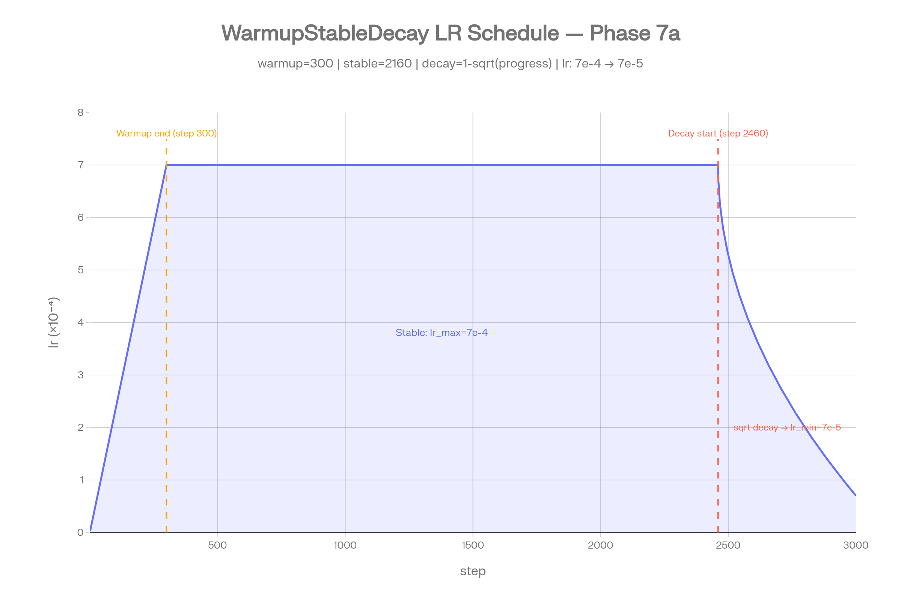
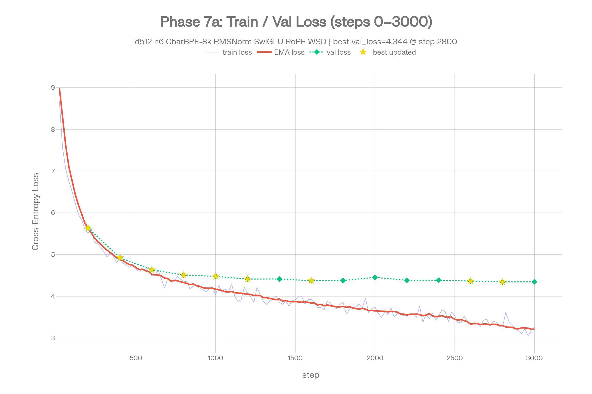

# チューニングのコツ

実装と実験を通じて得られた知見のまとめ。

## 学習データの整形
- **行ごとに切らず、 コーパス全体を 1 つの token 列に連結** してランダム窓でサンプリングする方が、 対話・改行・句読点などの構造を学習できる。
- 行ごとに `<EOS>` を付けると EOS バイアスが発生し、 推論時に 1 token で打ち切られやすくなる。 連結方式では EOS は不要 (`max_new_tokens` で停止)。

## 学習率
- `lr_max ≒ 3e-4`、 `lr_min ≒ 1e-5`、 `warmup_steps ≒ 200` が小規模 Transformer の典型値。 中規模 (~20-50M params) では `lr_max=5e-7e-4` が安定。
- `lr_min` を `0` 付近にすると終盤が完全に止まるため、 **`1e-5` 程度のフロアを残す**。
- checkpoint から `end_step` を伸ばして再開すると、 scheduler の進捗がリセットされて lr が上振れする (**warm restart 効果**)。 停滞局所解からの脱出に使える。
- **schedule の選択**:
  - **Cosine** (古典): warmup → 全期間で滑らかに減衰。 シンプルだが `total_steps` を変えると過去 step の lr が変わるので checkpoint からの追加学習に向かない。
  - **WarmupStableDecay (WSD)**: warmup → stable (lr_max 一定) → decay の 3 段。 大半を `lr_max` で回し、 終盤 15-20% で `1-sqrt(progress)` 減衰させる (MiniCPM/DeepSeek 流)。 同 BPC を 15-30% 早く到達できる場合があり、 さらに **stable 区間の checkpoint からそのまま追加学習に流用できる** (lr 軌道が変わらないため)。 Phase 6-d 以降は WSD を採用。



実際の WSD スケジュール例 (Phase 7a、 `end_step=3000`)。 step 300 で `lr_max=7e-4` に到達した後、
**stable 区間で 2,160 step (= 全体の 72%) は `lr_max` を維持**、 step 2,460 から `1-sqrt(progress)` で
急速に `lr_min=7e-5` まで減衰させる。 序盤の高 lr で粗く探索、 終盤の急減衰でローカルミニマムに収束、
というメリハリが付く。

## バッチとミニバッチ勾配
- `batch_size` 個の `forward_backward` で勾配を累積し、 まとめて 1 回 `apply_gradients` する。
- AdamW の `step_count` も 1 step に 1 回しか進めない (パラメータごとに進めない)。
- 累積勾配は `set_grad_scale(batch_size)` で平均化扱いにし、 `apply_gradients` 後に `zero_grad` でリセットする。

## モデル構造の比率
- `d_ff = 4 × d_model` が標準 (GPT-2、 nanoGPT 等)。 FFN は知識を蓄える主役なので `d_model` を増やすときは `d_ff` も比例して増やす。
- `d_head = d_model / n_heads = 32〜64` が扱いやすい。
- `max_len` を上げると attention は `O(n²)` で重くなる。 学習対象 (対話 1 ターン: ~100 token、 シーン: ~500 token) に合わせて選ぶ。

## 同規模モデルとの比較

| モデル | d_model | n_layers | パラメータ数 | 用途 |
|--------|---------|----------|------------|------|
| **本実装 (phase2)** | **256** | **4** | **~5.2M** | **本リポジトリ (`Config::tiny_shakespeare`)** |
| nanoGPT (Shakespeare 例) | 384 | 6 | 10.7M | Shakespeare 標準と比較 |
| GPT-2 small | 768 | 12 | 124M | 公開最小モデル |

本実装は nanoGPT Shakespeare 例の **約 1/2 サイズ**。 同じ Tiny Shakespeare コーパスに対して
`d_model` を 384→256、 `n_layers` を 6→4 に縮めた構成で、 学習時間と推論品質のバランス
(M1 Max で 10000 step ≒ 2 時間) を優先している。 下記「過学習と最適 step の見極め」で
品質ピークが step 2500〜3500 で訪れるのは、 このモデル容量と ~330k token コーパスの組み合わせに
固有のもの。 容量を nanoGPT と同等に上げれば品質ピークはより遅い step に移り、 GPT-2 small 級まで
スケールさせれば過学習までに使えるデータ量も大幅に増える。

## 推論時の繰り返し対策
- greedy はすぐに同じ語句に落ち込みやすいので、 **top-k サンプリング + 適度な temperature** (例: `top_k=5, temperature=1.0`) の方が自然な文章になる。
- `my lord, my lord, ...` のような繰り返しは **repetition penalty** で軽減する。 `LanguageModel::generate*` は `repetition_penalty` 引数を受け取り、 `1.1〜1.3` 程度が無難。 HuggingFace と同じ式 (正は割り算、 負は掛ける) で過去に出現した token を抑制。

## checkpoint 運用
- `run_name` を分けることで、 設定違いの実験を上書きせずに並走できる (`checkpoints/<run_name>/`)。
- モデル構造 (`d_model` 等) を変えると checkpoint 互換性が失われるため、 構造変更時は fresh start (`training_and_inference`) を使う。

## 過学習と最適 step の見極め

### Phase 7a (~21M params + 8.3M char コーパス + WSD): 健全な収束

Aozora 明治大正コーパスを `d_model=512, n_layers=6` (CharBPE 8K, WSD scheduler) で 3000 step 学習させた実例:



- **train loss (青)** と **EMA (赤)** はほぼ単調減少 (~9.0 → ~3.2)。
- **val loss (緑)** は step 200 で 5.6 → step 2800 で **4.34 (best)** まで継続的に改善し、 終盤までほぼ平坦に収まる。 train との **gap も拡大しない** (差は 1.0-1.2 nats で安定)。
- WSD の **decay 区間 (step 2460-3000)** で val が再度わずかに改善し、 step 2800 で best 更新。

このように **dropout=0.2 + weight_decay=0.1 + コーパス十分 (~5M token)** が揃うと、 val が単調に下がり続けて末端まで過学習しないのが理想形。 best checkpoint の選択も val_loss 最小で安全 (推論品質も連動)。

### 対照: Tiny Shakespeare (~5M params + 330k token、 正則化なし): 典型的な過学習パターン

参考までに、 ごく小規模なコーパスを正則化なしで長時間回すと逆のパターンになる。

| step | loss | perplexity | 推論品質 |
|------|------|-----------|---------|
| 500 | 4.51 | ~91 | 戯曲フォーマットだけ習得、 文は支離滅裂 |
| 2000 | 3.10 | ~22 | シーン構造成立、 局所文法 OK |
| **2500** | **2.79** | **~16** | **品質ピーク** (配役・トーン・流暢さがバランス良く整う、 [Phase 2 推論サンプル](phase2.md) 参照) |
| 3000 | 2.27 | ~10 | 品質ピーク帯の終わり |
| 3500 | 2.01 | ~7.5 | 単一シーン品質は時に絶品 (Richard III 等)、 ただし造語が混じり始める |
| 5000 | 0.88 | ~2.4 | 過学習開始 (BPE merge 由来の造語が頻発) |
| 10000 | 0.32 | ~1.4 | 完全記憶状態 (配役は更に絞り込まれるが造語多発) |

loss が下がり続けても汎化品質は途中から劣化する典型例。 **品質ピークは step 2500〜3500 の狭い帯**で、
それ以降は「loss は下がるが造語が増える死の谷」に入る。

### 教訓

- **checkpoint は val_loss が利用可能なら val_loss 最小で選ぶ** ([Phase 3 以降の `# val step=...` 行](#ログの読み方))。 dropout + weight_decay + 十分なコーパスがあれば train loss と相関する。
- **val が無い、 または信用できない場合** (Phase 2 Tiny Shakespeare のように 1 epoch 内に loss が極端に下がる場合) は推論品質ピークを定性的に探す必要がある。
- **大きめのモデル × 小さなコーパスは過学習しやすい**。 dropout 0.2 / weight_decay 0.1 が標準。 さらに小さなコーパスでは early stopping を併用。

## ログの読み方

```
# run_name=phase2_d256_ff1024_max128_with_accelerate
# d_model=256, n_heads=8, d_ff=1024, n_layers=4, max_len=128, vocab_size=4000
# lr_max=0.0003, lr_min=0.00001, warmup_steps=200, end_step=10000, ...
# corpus_tokens=331204, chunk_len=128, max_offset=331076
step,loss,ema,min,max,lr,ms_per_step,elapsed_s
20,7.922065,8.275023,7.922065,8.424044,3.000e-5,661.3,13.2
40,7.347139,7.785185,7.228264,7.922489,6.000e-5,655.5,26.3
...
```

| 列 | 意味 |
|----|------|
| `step` | 現在の学習ステップ |
| `loss` | 当該ステップでのバッチ平均 loss |
| `ema` | 指数移動平均 loss (α=0.05) |
| `min` / `max` | 直近 `log_every` ステップ内の最小 / 最大 loss |
| `lr` | 当該ステップでの学習率 |
| `ms_per_step` | 直近 `log_every` ステップでの 1 ステップあたり平均所要時間 (ミリ秒) |
| `elapsed_s` | 学習開始からの累積経過時間 (秒) |

`val_every` 間隔でコメント行として val 結果が挿入される (Phase 3 以降):

```
# val step=500 val_loss=1.5400 val_ppl=4.6646
```

`val_loss` は 90/10 split の validation 側からランダムに `val_n_batches` 個の窓を取って
計測した平均 cross-entropy loss。 dropout は自動的に無効化される。
